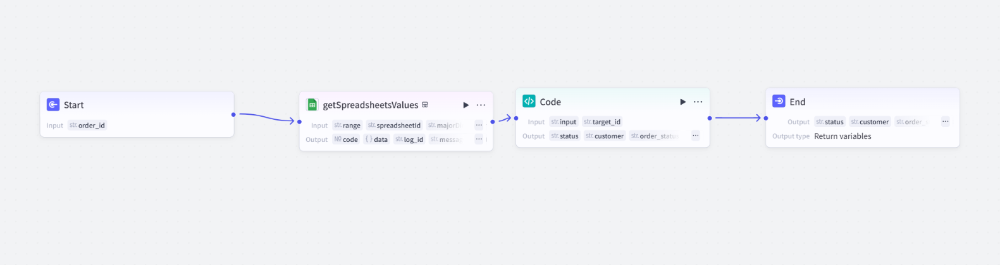
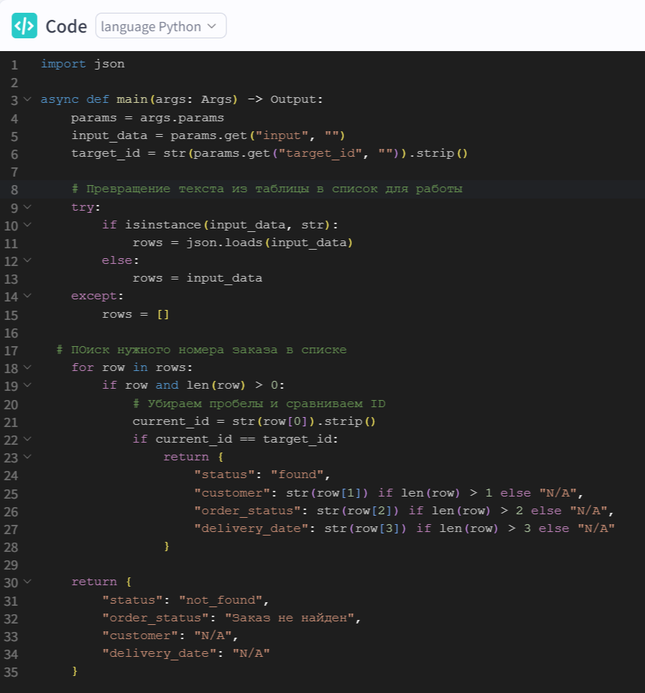

# Интеграция Telegram-бота с Google Sheets через Workflow

Проект по созданию бота техподдержки, который проверяет статус заказа во внешней таблице.

### Основные задачи:
* Настройка Workflow для связи Telegram-канала с Google Sheets API.
* Написание Python-скрипта для поиска строки по ID заказа.
* Настройка ответов: бот выводит имя клиента и статус напрямую из базы.
* Добавление кнопок для удобства пользователя.

---

## Этапы реализации и результаты

### 1. Интерфейс пользователя (Telegram)
Бот корректно распознает запрос, находит клиента в базе по ID и выводит персонализированный ответ.

<figure>
  
  <figcaption><i>Рис 1. Пример успешного запроса статуса заказа и работа интерактивных кнопок.</i></figcaption>
</figure>

### 2. Архитектура Workflow (Coze)
Визуальная схема связки блоков: от получения сообщения до финального вывода данных.

<figure>
  
  <figcaption><i>Рис 2. Логическая цепочка блоков в Coze Workflow.</i></figcaption>
</figure>

### 3. Программная логика (Python)
Код, который отвечает за обработку данных из Google Sheets и точное сопоставление ID заказа.

<figure>
  
  <figcaption><i>Рис 3. Python-скрипт для очистки данных и поиска совпадений.</i></figcaption>
</figure>
